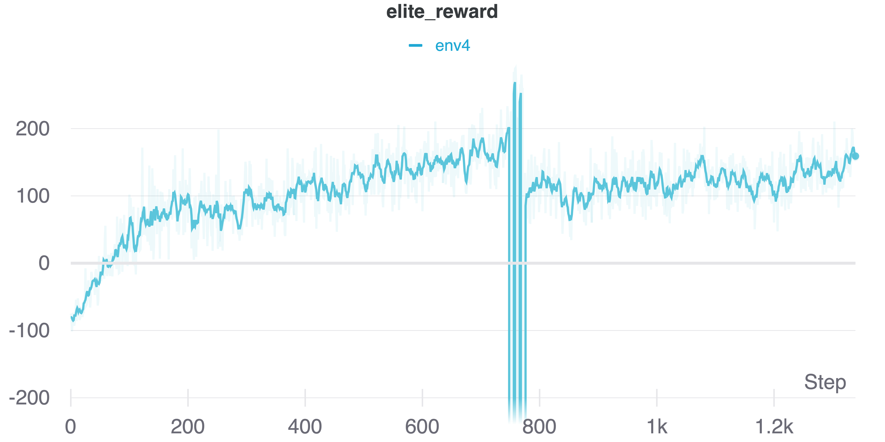
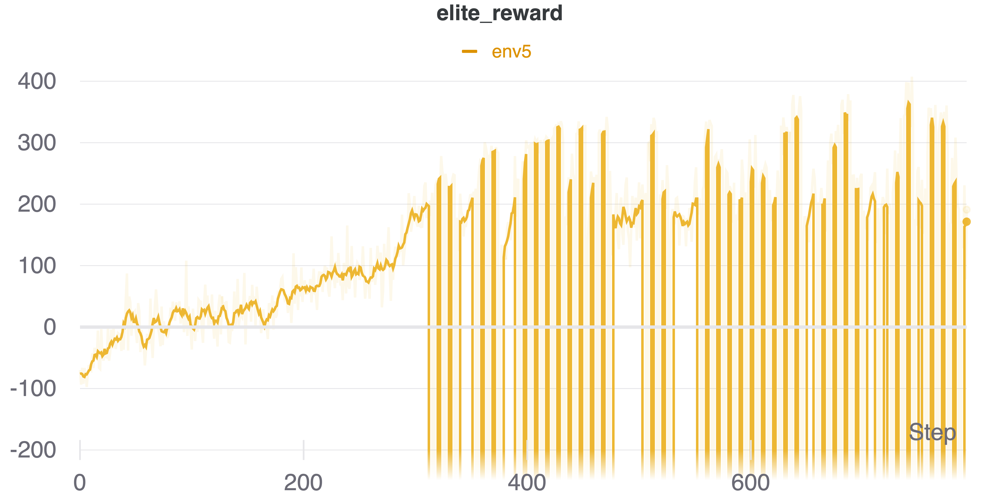

# RL Lunar Lander Project

### Step 1: Create a virtual env to run the project
```
python3 -m venv pyRLLander
source pyRLLander/bin/activate
```

### Step 2: Install requirements
```
wheel
Box2D (box2d-py or box2d-kengz on Mac)
pyglet
wandb
scipy
```

### Step 3: Install gym

First, clone the OpenAI Gym repository: https://github.com/openai/gym

```
mv lunar_lander.py ../gym/gym/envs/box2d/
cd ../gym
pip install -e .
```

### Step 4: Run the project
In the `multi_agents.py` file, choose your starting configuration. Then, run the following command:
```
python multi_agents.py
```

### Step 5: Test the agent
In `test.py`, update the location of the agent's pytorch file and the envionment paramters file.
```
python test.py
```

## Results
I trained the model on 5 independent environments with different parameters.


The following plots show how the elite agent performed as it worked towards solving the environment.

### Env 1:


### Env 2:


### Env 3:


### Env 4:




### Env 5:




## Resources used
- POET (https://arxiv.org/abs/1901.01753)
- Self-Constructing Neural Networks Through Random Mutation (https://arxiv.org/abs/2103.15692)
- OpenAI Gym (https://github.com/openai/gym)
- Weights & Biases (https://wandb.ai)


